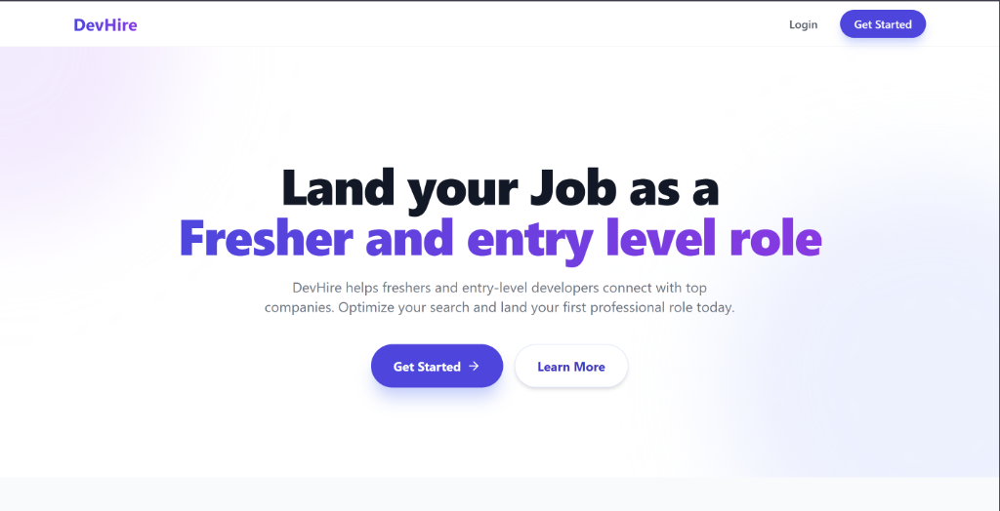
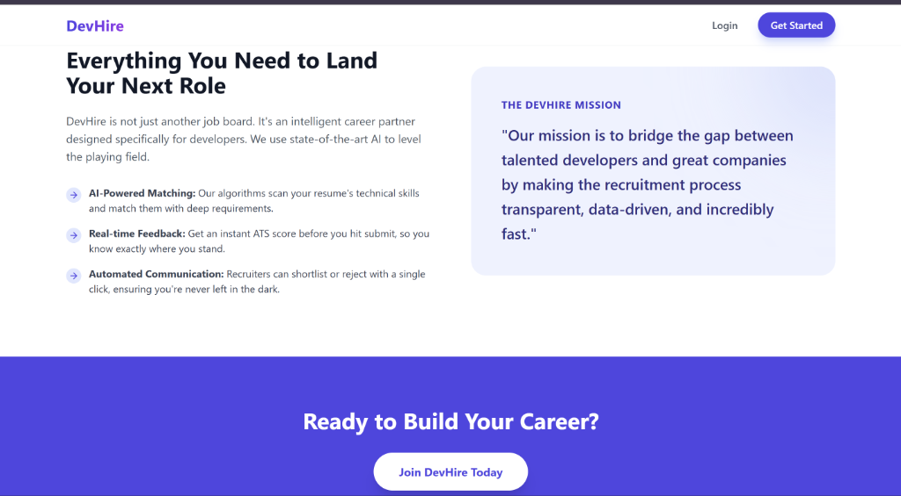
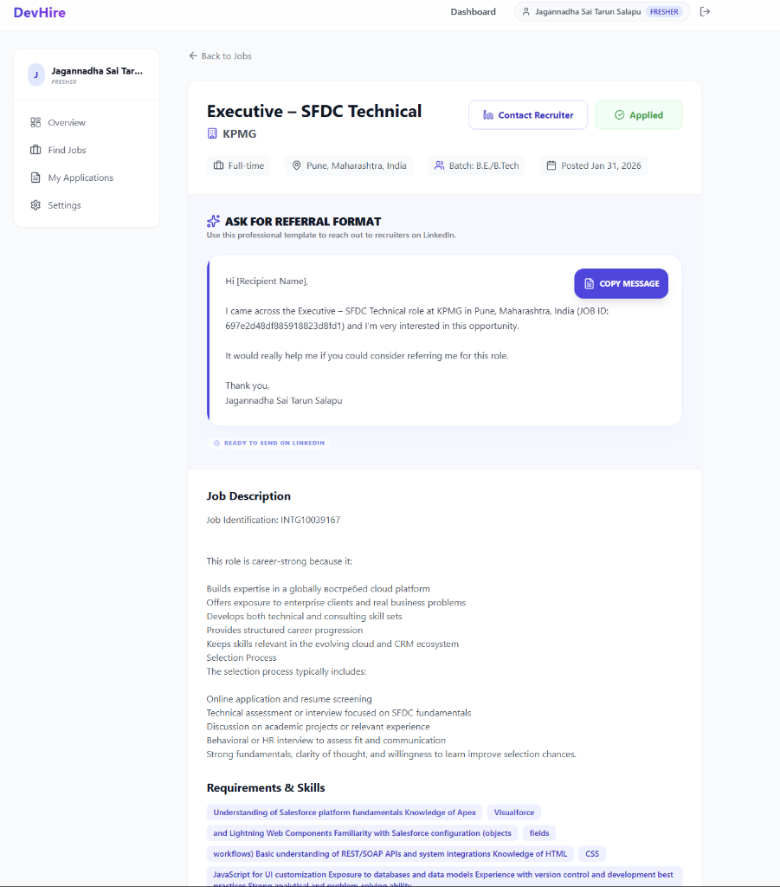
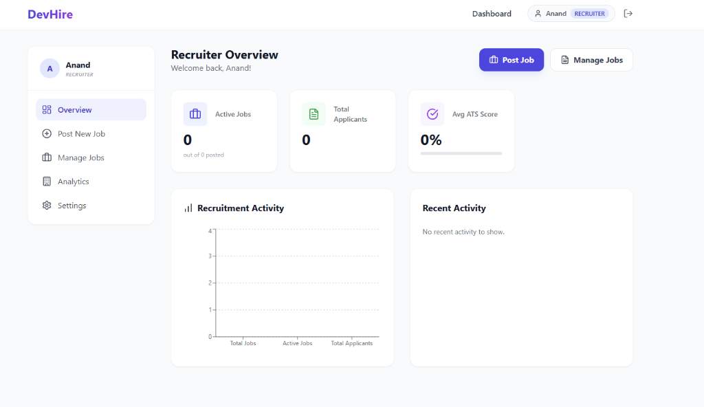
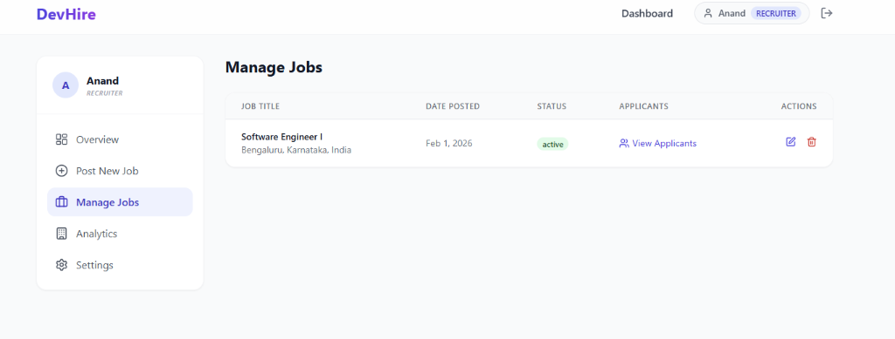
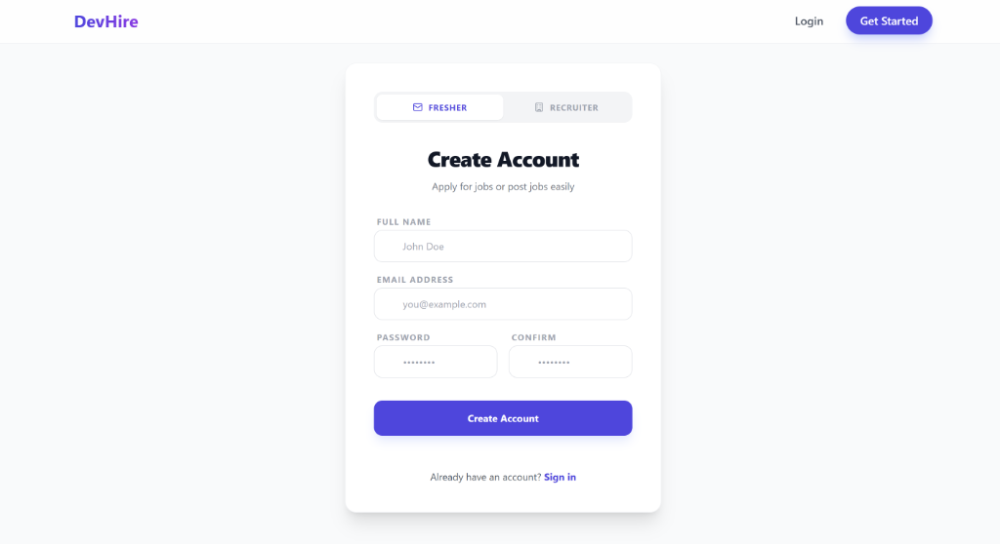

#  DevHire - My Job Portal Project

Hey everyone! Thanks for checking out my project. I built **DevHire** because I wanted to make a simple and clean place where students can find jobs and companies can hire them without any confusion. It's a full-stack project I worked really hard on.

###  Live Link to see the site
**[Click here to open DevHire](https://devhire-frontend.onrender.com)**  

> **Note:** Since I am using a free server, please wait for about 30-40 seconds for the page to open the first time. The server needs a little time to "wake up." Once it starts, it works perfectly!

---

### What can you do on this site?

I tried to keep things very simple:
*   **If you are a Student:** You can search for the latest jobs, see all the details, and apply with just one click. I also made a dashboard so you can see where you applied. My favorite feature is the **"Referral Format"** - it gives you a ready-made message to send to recruiters!
*   **If you are a Recruiter (Company):** You can post new jobs in seconds, see everyone who applied, and even check their resumes right there. I also added some cool charts to show your hiring stats and a little bit of AI to help you find the best candidates.

---

<<<<<<< HEAD
### 📸 App Gallery
=======
###  Screenshots of the App
>>>>>>> dc2c202508b1c15f9a68d3a8ea40efe7daed64e1

  <h3>Home Page</h3>
  

    
  
  <h3>Smart Features</h3>
  

    

  <h3>Referral Format for Students</h3>
  
<i>(I added this to help freshers reach out to companies easily!)</i>

  

    

  

    
    
  

  
<i>Left: Recruiter Overview | Right: Manage Postings</i>

    

  <h3>Easy Registration</h3>
  

---

### What did I use to build this?
I used the **MERN Stack** because it's very powerful and modern:
*   **React & Tailwind CSS**: For making the website look beautiful and work well on phones.
*   **Node.js & Express**: To handle all the logic in the background.
*   **MongoDB**: To store all the user data and job info safely.
*   **Redux Toolkit**: To keep everything synced up across the app.

---

Hope you like what I've built! If you do, please give it a ⭐ on GitHub.

Thanks for looking! 
- **Tarun**
